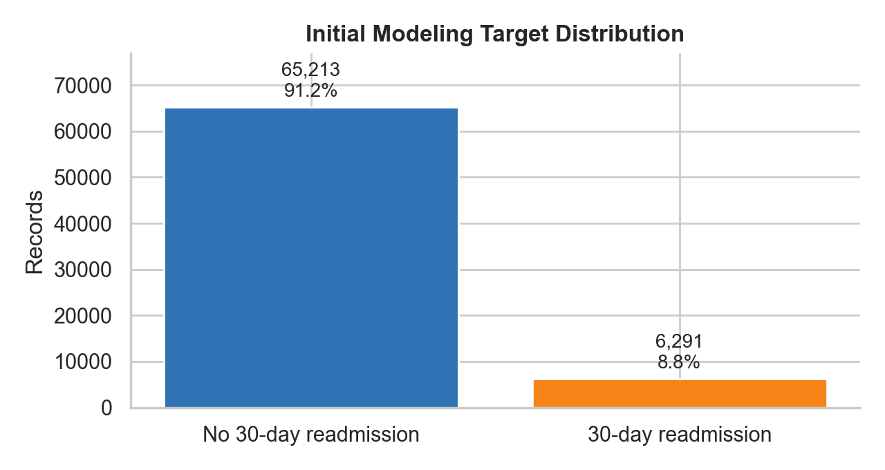
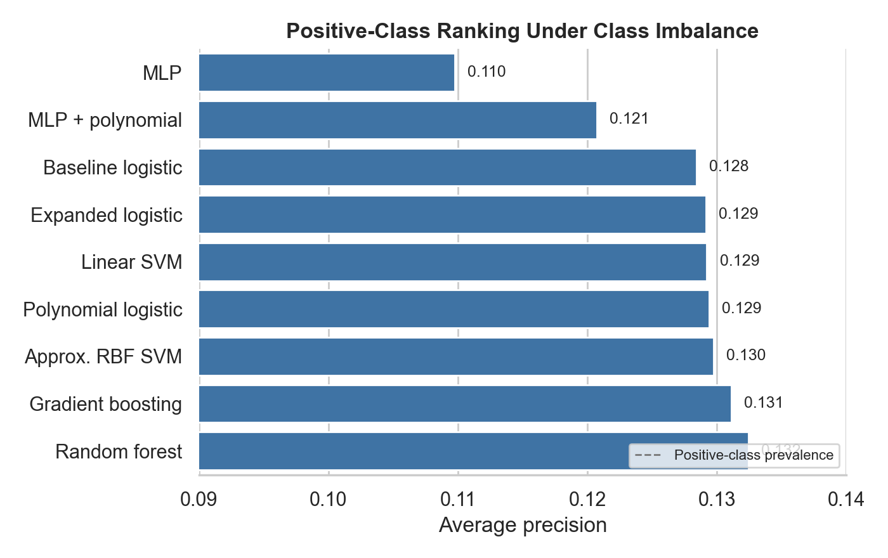
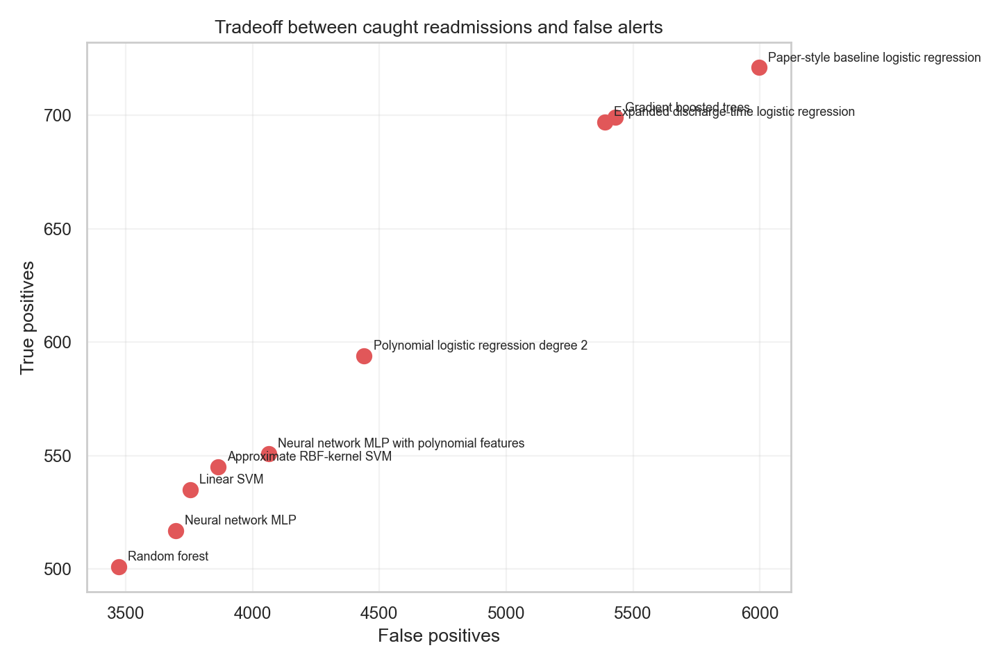
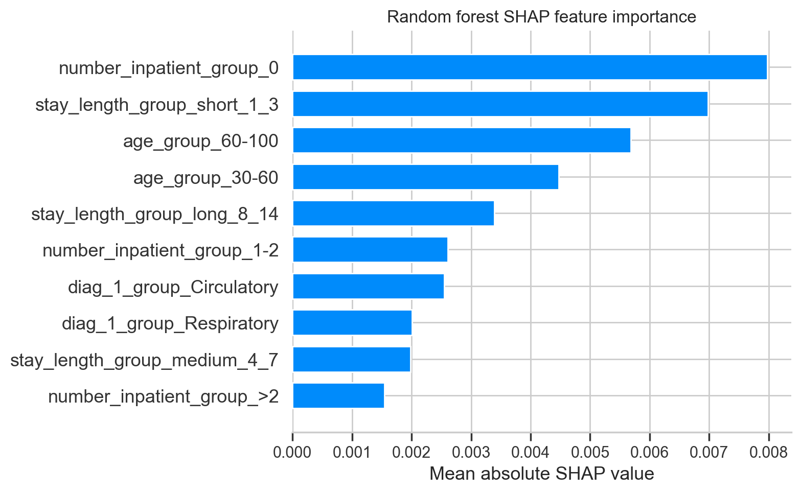
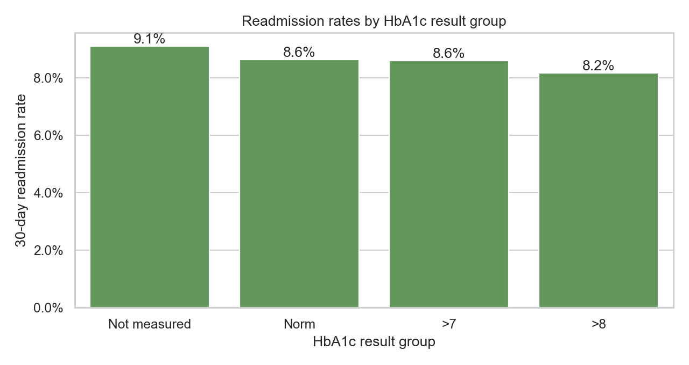

### Predicting 30-Day Hospital Readmission for Patients With Diabetes

**Grzegorz Adamiec**

#### Executive summary

This capstone project asks whether machine learning can help identify patients with diabetes who are likely to return to the hospital within 30 days of discharge. The project also tests whether HbA1c measurement and other discharge-time information improve prediction compared with a simpler model that uses information available closer to admission.

The main finding is that the models perform only slightly better than chance. The best models can rank higher-risk patients somewhat better than a random guess, but their precision is low. In practical terms, the strongest models still create about 8 to 9 false alerts for every true readmission they flag.

HbA1c measurement and the tested discharge-time features do not significantly improve prediction. The expanded logistic regression model catches 100 additional true readmissions compared with the baseline logistic regression model, but it also creates 961 additional false positives on the test set.

The project is useful as a technical exploration, but the current models should not be used for clinical or operational decisions without major additional validation, calibration, and fairness review.

The main analysis is in the [Jupyter notebook](diabetes.ipynb). Supporting model-evaluation code is in [src/model_evaluation.py](src/model_evaluation.py).

#### Rationale

Hospital readmission is costly for hospitals and disruptive for patients. For people with diabetes, early readmission may reflect disease severity, gaps in discharge planning, limited outpatient follow-up, or other health and social factors that are not fully captured in hospital records.

If a model could reliably identify higher-risk patients, hospitals might use that information to prioritize follow-up calls, discharge planning, medication review, or outpatient support. However, the model must be evaluated carefully. A model that flags too many people incorrectly can waste limited clinical resources, while a model that misses too many readmissions may not be useful.

#### Research Question

Can machine learning models predict whether a patient with diabetes will be readmitted to the hospital within 30 days?

A secondary question is whether HbA1c measurement and other discharge-time information improve prediction compared with a baseline model that uses information available closer to admission.

This is a supervised binary classification problem. The outcome is:

- `1`: readmitted within 30 days
- `0`: not readmitted within 30 days

This project is predictive, not causal. If a model performs better after adding HbA1c or discharge-time variables, that does not prove those variables cause readmission risk to change.

#### Data Sources

The analysis uses the UCI **Diabetes 130-US Hospitals for Years 1999-2008** dataset, associated with:

Strack, B., DeShazo, J. P., Gennings, C., Olmo, J. L., Ventura, S., Cios, K. J., and Clore, J. N. (2014). *Impact of HbA1c Measurement on Hospital Readmission Rates: Analysis of 70,000 Clinical Database Patient Records.* BioMed Research International, 2014, 781670. https://doi.org/10.1155/2014/781670

The raw dataset contains 101,766 hospital encounters. The analysis keeps the first encounter for each patient, resulting in 71,518 patient-level records before model-specific cleaning. The initial model-ready cohort contains 71,504 records. The discharge-time model-ready cohort contains 69,960 records after removing death and hospice-related discharge dispositions.

| Dataset quantity | Value |
|---|---:|
| Raw encounters | 101,766 |
| First encounter per patient | 71,518 |
| Initial model-ready records | 71,504 |
| Discharge-time model-ready records | 69,960 |
| Initial positive rate | 8.8% |
| Discharge-time test positive rate | 9.0% |

The dataset is de-identified and is used only for educational analysis. It should not be used to make patient-care recommendations from this project.

#### Methodology

The notebook cleans and prepares the data by keeping one encounter per patient, removing invalid or incomplete records needed for modeling, grouping diagnosis codes into broader categories, grouping prior hospital utilization counts, and one-hot encoding categorical variables.

The baseline model uses information available near admission, including age group, race group, gender, admission type, admission source, primary diagnosis group, and prior outpatient, emergency, and inpatient utilization.

The expanded discharge-time model adds information available during or by the end of the hospital encounter:

- length of stay
- HbA1c test result
- maximum glucose serum result
- whether diabetes medication changed during the encounter

The train/test split is stratified so that the rare 30-day readmission outcome appears at a similar rate in training and test data. The notebook compares several supervised classification models, including logistic regression, polynomial logistic regression, gradient boosted trees, random forest, support vector machines, and neural network models.

`GridSearchCV` is used for hyperparameter tuning. Average precision is used as the main tuning metric because the readmission outcome is highly imbalanced and accuracy would be misleading.

#### Results

The models predict slightly better than chance, but the overall signal is weak. Only about 8.8% of model-ready records are positive 30-day readmissions, so a useful model needs to do more than achieve high accuracy by predicting that most patients will not be readmitted.

The best model by ranking metrics is the random forest, with ROC-AUC of 0.596 and average precision of 0.132. Gradient boosted trees are close behind, with ROC-AUC of 0.594 and average precision of 0.131. Since the positive-class rate is about 9%, these average precision values are only modestly better than the baseline rate.

| Model | TP | FP | Precision | Recall | Balanced accuracy | ROC-AUC | Avg. precision |
|---|---:|---:|---:|---:|---:|---:|---:|
| Random forest | 681 | 5,194 | 0.116 | 0.543 | 0.567 | 0.596 | 0.132 |
| Gradient boosted trees | 572 | 4,038 | 0.124 | 0.456 | 0.569 | 0.594 | 0.131 |
| Expanded discharge-time logistic regression | 697 | 5,389 | 0.115 | 0.555 | 0.566 | 0.590 | 0.129 |
| Paper-style baseline logistic regression | 597 | 4,428 | 0.119 | 0.476 | 0.564 | 0.586 | 0.128 |
| Neural network MLP | 394 | 3,071 | 0.114 | 0.314 | 0.536 | 0.559 | 0.110 |

The practical tradeoff is the most important result. Models that catch more true readmissions also create many false positives.

The most defensible model depends on the goal:

- If the goal is ranking patients by risk, random forest is strongest by ROC-AUC and average precision.
- If the goal is balancing readmission detection with fewer false alerts, gradient boosted trees are the better compromise.
- If the goal is broad screening and follow-up resources are plentiful, expanded logistic regression may be acceptable, but it creates many false alerts.

The notebook uses SHAP to inspect models where the explanation stays tied to the model-facing feature matrix: the logistic-regression models, gradient boosted trees, random forest, and linear SVM. The approximate RBF-kernel SVM and neural-network models are not included in the SHAP section because their explanations would either refer to transformed components or require slow model-agnostic approximations. SHAP views are limited to the 10 most important features.

The SHAP results suggest that the models are mostly learning broader hospital-utilization and clinical-complexity patterns. Prior inpatient history is one of the strongest signals: patients with no prior inpatient visits generally appear lower risk, while prior inpatient use is more concerning. Age also matters, especially the older age group. In the expanded models, length of stay becomes important, which may reflect illness severity, care complexity, or discharge-planning needs.

Diagnosis category also contributes to the predictions. Circulatory and respiratory diagnosis groups appear repeatedly among important features, suggesting that a deeper diagnosis analysis could be useful. The current project uses broad primary-diagnosis groups, so some clinically meaningful detail may be lost. HbA1c-related variables, by contrast, are not consistently among the strongest model drivers.

HbA1c groups also have similar readmission rates in this dataset, which helps explain why HbA1c categories do not add much predictive value.

#### Next steps

Possible next steps are:

- Review the findings with clinicians, nurses, discharge planners, or hospital operations staff to decide what kind of readmission-risk alert would actually be useful and when it would need to be available.
- Improve the diagnosis analysis. This project used broad groups based mainly on the primary diagnosis. A next version should examine secondary diagnoses, the number of diagnoses, and more detailed diagnosis combinations with medical input.
- Revisit features that were simplified or excluded in this version, especially prior utilization details, medical specialty, payer information, lab and procedure counts, medication classes, and discharge disposition. Some of these fields have missing data or may only be available later in the hospital stay, so their use should match the intended decision point.
- Add information that is not available in this dataset but may be important for readmission risk, such as outpatient follow-up availability, medication adherence, social support, insurance constraints, and access to primary care.
- Use the SHAP findings to guide feature design before trying more models. The next improvement should focus on clinically meaningful variables, not only on model tuning.
- Evaluate model results with the people who would act on them. The key question is not only whether the model score is higher, but whether the alerts would help staff make better decisions without creating too many unnecessary follow-ups.

None of the current models is ready for clinical or operational deployment without clinical review, stronger feature validation, external testing, and fairness checks across patient groups.

#### Outline of project

- [Main analysis notebook](diabetes.ipynb)
- [Model evaluation helper module](src/model_evaluation.py)
- [Target distribution figure](images/target_distribution.png)
- [HbA1c readmission rate figure](images/a1c_readmission_rate.png)
- [Model average precision figure](images/model_average_precision.png)
- [True-positive and false-positive tradeoff figure](images/tp_fp_tradeoff.png)
